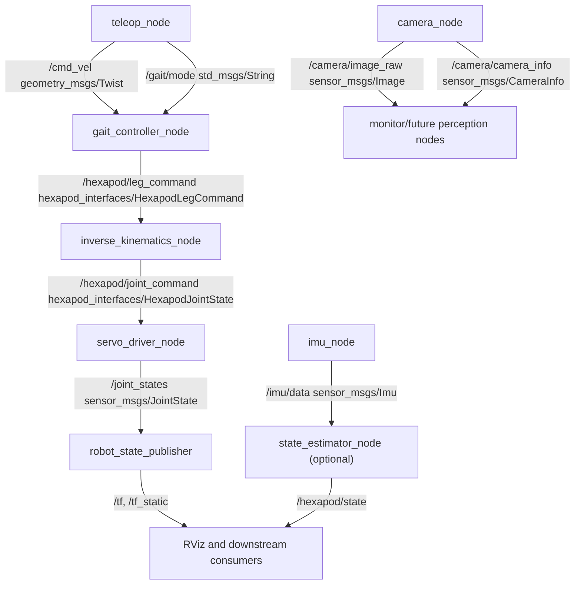

# ROS 2 Hexapod Architecture (Python, Jazzy)

## 1) System Overview

### Purpose
This architecture defines a clean ROS 2 software structure for a six-legged (hexapod) robot focused on **manual locomotion control**. It is designed to be practical for early development while remaining extensible for future autonomous capabilities.

### Scope
In-scope for this phase:
- Manual command input (keyboard/joystick)
- Gait command generation for locomotion
- Inverse kinematics conversion to joint targets
- Servo actuation through hardware abstraction
- IMU and camera data streaming
- Robot state publication for transforms and visualization

Out-of-scope for this phase:
- Autonomous navigation
- Mapping and localization
- Computer vision inference
- Full-body dynamic optimization

### ROS 2 Node-Based Model
The system is decomposed into independent ROS 2 nodes that communicate via topics. This supports:
- Loose coupling between subsystems
- Better testability and fault isolation
- Easier future replacement of hardware and algorithms
- Gradual scaling toward autonomy

---

## 2) Design Principles

### Modularity
Each functional domain is isolated into packages and nodes (teleoperation, control, kinematics, hardware, sensors, bringup). This allows independent iteration and testing.

### Separation of Concerns
High-level intent (velocity/gait commands), motion generation (gait + IK), and low-level actuation (PWM/servo output) are intentionally separated so each layer can evolve without forcing cross-layer rewrites.

### Hardware Abstraction
All physical servo communication is constrained to the hardware layer. Control nodes publish generic commands without direct awareness of PWM chips or bus protocols.

### Real-Time Considerations (Lightweight)
Python is acceptable for this architecture phase if control loop frequencies are realistic for hobby/medium hexapods. Timing-sensitive boundaries should be explicit:
- Stable command update loops (for example, 20-100 Hz for control layers)
- Timestamped messages and watchdog behavior in hardware node
- Minimal per-cycle allocation and logging in hot loops

### Future Extensibility
Interfaces and package boundaries are designed to support:
- Replacing manual teleop with planner/autonomy
- Swapping hardware drivers (real robot vs simulation)
- Upgrading gait logic without touching teleop or hardware

---

## 3) Node Responsibilities

## Core Control Path

### `teleop_node`
- Reads operator input from keyboard/joystick
- Publishes body-level movement intent (linear/angular velocity, mode)
- Supports emergency stop and gait mode selection
- Produces no kinematics or servo-level outputs

### `gait_controller_node`
- Subscribes to operator command topics
- Generates foot trajectory targets per leg for simple gait patterns
- Handles gait state machine (stand, walk, turn, stop)
- Publishes leg-level trajectory command message

### `inverse_kinematics_node`
- Converts per-leg foot targets into joint angles
- Applies geometric limits and validity checks
- Publishes joint commands for all legs

### `servo_driver_node`
- Receives joint commands
- Maps joint angles to servo pulse outputs
- Sends hardware-specific PWM commands (for example PCA9685)
- Enforces safety bounds, watchdog timeout, and neutral fallback

## Sensors and State

### `imu_node`
- Reads IMU device data
- Publishes standard IMU message stream
- Handles calibration offsets and frame conventions

### `camera_node`
- Captures camera frames
- Publishes raw image stream (+ optional camera info)
- No CV processing in current scope

### `state_estimator_node` (optional, recommended)
- Aggregates IMU (and optionally commanded motion)
- Publishes lightweight body-state estimate (orientation, stability metrics)
- Not a localization or SLAM solution

### `robot_state_publisher`
- Publishes TF tree from robot model and joint states
- Enables RViz visualization and frame consistency

---

## 4) Topics and Message Flow

## Proposed Topics

| Topic | Type | Publisher | Subscriber(s) | Purpose |
|---|---|---|---|---|
| `/cmd_vel` | `geometry_msgs/Twist` | `teleop_node` | `gait_controller_node` | Body velocity command from operator |
| `/gait/mode` | `std_msgs/String` | `teleop_node` | `gait_controller_node` | Gait selection (stand/walk/turn) |
| `/hexapod/leg_command` | `hexapod_interfaces/HexapodLegCommand` | `gait_controller_node` | `inverse_kinematics_node` | Desired foot targets per leg |
| `/hexapod/joint_command` | `hexapod_interfaces/HexapodJointState` | `inverse_kinematics_node` | `servo_driver_node`, `robot_state_publisher` (via adapter if needed) | Joint targets for actuation and state publication |
| `/imu/data` | `sensor_msgs/Imu` | `imu_node` | `state_estimator_node` (+ tools) | IMU stream |
| `/camera/image_raw` | `sensor_msgs/Image` | `camera_node` | Monitoring tools, future CV nodes | Camera stream |
| `/camera/camera_info` | `sensor_msgs/CameraInfo` | `camera_node` | Monitoring tools, future CV nodes | Camera calibration metadata |
| `/hexapod/state` | `geometry_msgs/PoseStamped` or custom lightweight state msg | `state_estimator_node` | Visualization, logging, future control nodes | Basic body state estimate |
| `/joint_states` | `sensor_msgs/JointState` | `servo_driver_node` (or converter node) | `robot_state_publisher`, RViz | Reported/measured joint state |

## Message Flow (Conceptual)
- Operator intent: `teleop_node` -> `/cmd_vel`, `/gait/mode`
- Locomotion synthesis: `gait_controller_node` -> `/hexapod/leg_command`
- Kinematics mapping: `inverse_kinematics_node` -> `/hexapod/joint_command`
- Actuation: `servo_driver_node` -> physical PWM output
- State and sensing: `imu_node`, `camera_node` -> data topics
- Frame publication: `/joint_states` -> `robot_state_publisher` -> `/tf`, `/tf_static`

## Mermaid Diagram



---

## 5) ROS 2 Workspace and Package Structure

## Proposed Workspace

```text
hexapod_ws/
├── src/
│   ├── hexapod_bringup/
│   ├── hexapod_description/
│   ├── hexapod_control/
│   ├── hexapod_hardware/
│   ├── hexapod_interfaces/
│   ├── hexapod_sensors/
│   └── hexapod_teleop/
└── docs/
    └── architecture.md
```

## Package Roles

### `hexapod_bringup`
- Launch files for complete and partial system startup
- Parameter profiles (dev, real robot, bench test)
- Runtime wiring (namespaces/remaps where needed)

### `hexapod_description`
- URDF/Xacro robot model and link/joint definitions
- Sensor frame definitions
- RViz configuration assets

### `hexapod_control`
- `gait_controller_node`
- `inverse_kinematics_node`
- Optional simple control utility nodes (for example command filter)

### `hexapod_hardware`
- `servo_driver_node`
- Hardware adapter interfaces and board-specific backend implementations
- Safety/watchdog policies

### `hexapod_interfaces`
- Custom messages for leg and joint command semantics
- Optional custom services/actions as complexity grows

### `hexapod_sensors`
- `imu_node`
- `camera_node`
- `state_estimator_node` (optional, if treated as sensing/state fusion)

### `hexapod_teleop`
- `teleop_node`
- Input mappings (keyboard/joystick profile parameters)

---

## 6) Interface Definitions (Custom Messages)

Custom messages are justified when standard messages do not express hexapod-specific grouping cleanly (6 legs, per-leg targets, consistent indexing and timing metadata). They reduce ambiguity and keep node contracts explicit.

## `HexapodLegCommand.msg` (proposed)
Purpose: carry desired foot-space targets generated by the gait layer.

Proposed fields:
- `std_msgs/Header header`
- `string gait_mode` (for example: `stand`, `tripod_walk`, `turn`)
- `float32 cycle_phase` (0.0-1.0 global gait phase)
- `string[6] leg_names` (stable order, for example `lf`, `lm`, `lr`, `rf`, `rm`, `rr`)
- `geometry_msgs/Point[6] foot_positions` (target xyz per leg in body frame)
- `bool[6] stance_mask` (`true` = stance, `false` = swing)

## `HexapodJointState.msg` (proposed)
Purpose: carry joint-space command or feedback grouped per leg with explicit ordering.

Proposed fields:
- `std_msgs/Header header`
- `string[18] joint_names` (3 joints x 6 legs in deterministic order)
- `float32[18] position` (radians or configured angular unit)
- `float32[18] velocity` (optional command/feedforward, set zero if unused)
- `float32[18] effort` (optional, set zero if unused)
- `uint8 control_mode` (enumeration for position/velocity/torque intent)

Notes:
- If interoperability with existing tools is preferred, bridge or mirror into `sensor_msgs/JointState`.
- Define and document unit conventions once (radians, frame orientation, index order).

---

## 7) Launch System Design

## `bringup.launch.py` (design intent)
- Starts all required runtime nodes for manual locomotion:
  - `teleop_node`
  - `gait_controller_node`
  - `inverse_kinematics_node`
  - `servo_driver_node`
  - `imu_node`
  - `camera_node`
  - `robot_state_publisher`
  - `state_estimator_node` (toggle via launch argument)
- Loads parameter files per node (YAML)
- Supports launch arguments such as:
  - `use_sim_time`
  - `use_state_estimator`
  - `hardware_backend` (for example `pca9685`, `mock`)
  - `teleop_device` (`keyboard`, `joystick`)
  - `robot_namespace`

## Parameter Strategy
- Centralized default parameter sets in each package
- Override precedence from bringup launch arguments
- Keep hardware calibration values isolated in hardware package parameters

## Namespacing Strategy
- Support optional namespace like `/hexapod` for multi-robot readiness
- Keep TF frame IDs consistent and namespaced where appropriate
- Avoid hardcoded absolute topic names in internal nodes

---

## 8) Hardware Abstraction Strategy

Servo actuation is the most hardware-specific layer and should remain replaceable.

### Why abstraction is required
- PWM boards and motor drivers vary in APIs, timing, and constraints
- Simulation backends need command compatibility without physical buses
- Hardware replacement should not require changing gait or IK logic

### Separation model
- **Control layer** (`hexapod_control`): computes desired motion in abstract units
- **Hardware interface layer** (`hexapod_hardware`): maps abstract joint commands to device-specific outputs

### Swappable backends
Design `servo_driver_node` around a backend adapter concept:
- Real backend (for example PCA9685 I2C)
- Mock backend (software-only tests)
- Simulation backend (bridge to simulator actuator APIs)

All backends expose the same logical input contract (`HexapodJointState`), preserving upper-layer stability.

---

## 9) Future Work / Extensibility

Planned evolution paths that this architecture intentionally supports:
- Add autonomy stack with planner/controller nodes replacing or augmenting `teleop_node`
- Integrate Nav2 for navigation behaviors where terrain and sensing allow
- Add SLAM/localization pipelines once depth or suitable sensors are available
- Introduce gait optimization and adaptive foothold strategies
- Add reinforcement learning policy nodes as alternative high-level command sources
- Add full simulation pipeline (Gazebo/Ignition) using the same interfaces and launch patterns

---

## 10) Summary

This architecture keeps the initial system focused on manual locomotion while establishing production-grade ROS 2 boundaries:
- Clear node contracts
- Explicit topic and interface design
- Strict hardware abstraction
- Launch/parameter patterns that scale

The result is a practical base that can be implemented incrementally now and extended toward autonomous hexapod behavior later without major structural rework.
